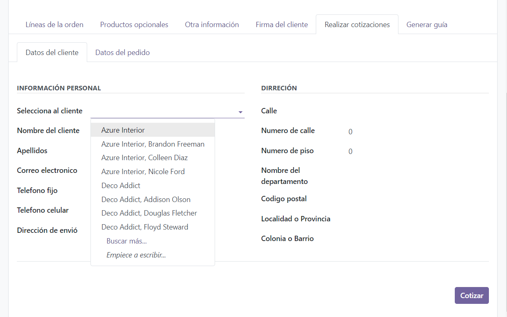

# Nombre del modulo
Shipment
    
# Descripción:
El modulo shipment permite el registro de pedidos y envios en el api de Enviópack, además de que facilita el proceso para obtener la guia de los envios registrados en el api.Ademas de permitir la consulta de cotizaciones de envios a la Api de Enviópack.

# Requisitos:
    1.Odoo 17
    2.Python 3.12.1
    3.Access token de la api de Enviópack

# Usos
## Claves de la api
Para ingresar los datos de la api solo se debe de ingresar a paramentros del sistema e ingresar el Api_key y Secret_api de la cuenta de Enviópack.

## Consultar cotizaciones 
Se debe de ingresar a la orden del pedido (orders) y entrar en la pestaña con el nombre de "Cotizaciones", en esta pestaña debera de seguir los siguientes pasos:
1. Seleccionar el nombre del cliente para rellenar los campos con su información.

2. Colocar el ID de la direcion de donde va a salir el envio.

3. Si es necesario editar la información necesaria para el envio.

4. Ingresar el codígo postal del lugar a dónde se realizara el envió, para que se realice la busqueda del id de la provincia a la api.
5. Colocar las medidas del paquete a si como su peso para la cotización.

6. Por ultimo solo se debe de presionar el botón de "Cotizar", esto hara que en la pestasña de "Generar Guía" se muestren la lista de las cotizaciones realizadas a el api de Enviópack, como se muestra a continuacion.

## Registrar o Crear guia de envio.
Una vez que se haya consultado las cotizaciones del pedido se debe de dirigir a la pestaña "Generar Guía" en la cúal se encuentran la lista de las cotizaciones realizadas basadas en la información del pedido. Por lo que para la creación de la guia del envio en el api de Enviópack se debe de presionar el botón de "Generar guia", este ejecutara las funciones pertinentes para que se lleve acabo el proceso del registro en el api.

Al registrar presionar el botón de "Generar Guía" las funciones de el registro del pedido y envio, asi como tambien el dela consulta de la etiqueta de envió la cual con ayuda de la otra funcio muestra la etiqueta en un PDF descargable en el Chatter de Odoo.

